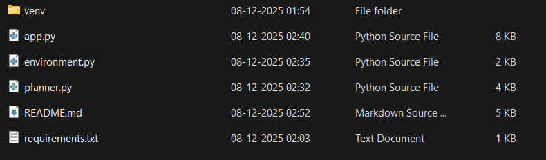
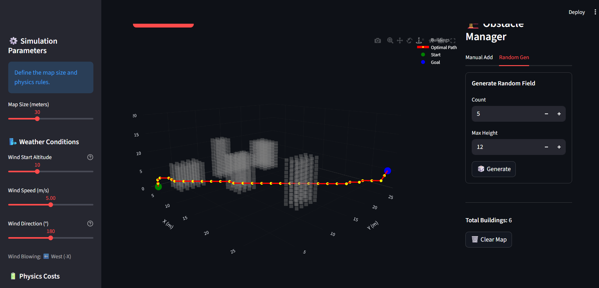

# 🚁 Intelligent UAS Trajectory Optimizer

[](https://www.python.org/)
[](https://streamlit.io/)
[](https://plotly.com/)

**A 3D path-planning simulator that computes the most energy-efficient trajectory for Unmanned Aerial Systems (UAS) in a complex urban environment.**

---

## 📖 Description

The **Intelligent UAS Trajectory Optimizer** simulates an urban airspace, models wind and gravity effects, and computes the minimum-energy flight path using a modified **A\* search** with 26-direction 3D movement.

This system accounts for:

- **Wind vectors** (tailwinds reduce energy cost, headwinds increase it)  
- **Gravity** (climbing costs more energy than descending)  
- **Obstacles** (3D voxel buildings and no-fly zones)  
- **Safety penalties** (flying too low is penalized)

Users configure the environment interactively using a Streamlit UI and visualize the trajectory instantly in a 3D Plotly scene.

---

## 🏗️ System Architecture (ASCII Diagram)

```
                  +----------------------------------+
                  |   User Interface (Streamlit)      |
                  | - Takes Start/Goal                |
                  | - Wind Settings                   |
                  | - Obstacle Builder                |
                  +-----------------+------------------+
                                    |
                                    | Inputs
                                    v
                   +----------------+----------------+
                   |          Environment Module     |
                   | (environment.py)                |
                   | - Builds 3D Grid                |
                   | - Applies Wind Field            |
                   | - Stores Obstacles              |
                   +----------------+----------------+
                                    |
                                    | Grid + Wind Field
                                    v
                     +--------------+---------------+
                     |            Route Planner     |
                     |          (planner.py)        |
                     | - 26-direction A* Search     |
                     | - Energy Cost Model          |
                     | - Gravity + Wind Effects     |
                     +--------------+---------------+
                                    |
                                    | Optimal Path (waypoints)
                                    v
             +----------------------+------------------------+
             |           3D Visualization (Plotly)           |
             | - Renders Obstacles                           |
             | - Renders Optimal Path                        |
             | - Interactive 3D Controls                     |
             +-----------------------------------------------+
```

---

## 🔧 ASCII Architecture Diagram

```
[ User (Browser) ]
          |
          v
    +------------+        builds Airspace        +------------------+
    |  app.py    | ----------------------------> | environment.py   |
    | (Frontend) | <---------------------------- |  (Airspace Grid) |
    +------------+          grid + wind          +------------------+
          |
          v
 sends airspace + start/goal
          |
          v
    +-----------------+
    |  planner.py     |
    | (A* Energy Cost)|
    +-----------------+
          |
          v
    Optimal Path (3D points)
          |
          v
   Plotly 3D Visualization
```

---

## ✨ Features

### 🛰️ Physics-Aware Pathfinding
- Wind-aware movement  
- Gravity-based climb/descend costs  
- Low-altitude safety penalties  

### 🏙️ Obstacle Handling
- Manual obstacle placement  
- Random city generation  
- 3D voxels mapped into grid space  

### 📈 Visualization
- Real-time 3D Plotly renderer  
- Red path line, gray obstacles  
- Start & Goal markers  

---
## 🛠️ Tech Stack

- **Language:** Python 3.x  
- **Frontend:** Streamlit  
- **Visualization:** Plotly  
- **Math & Arrays:** NumPy  
- **Algorithms:** `heapq` (priority queue for A*)  

---

## 📂 Project Structure

```
├── images/
│   ├── demo_setup.png
│   └── demo_path.png
├── app.py
├── environment.py
├── planner.py
├── requirements.txt
└── README.md
```

---

## 📸 Demo & Screenshots

### 1. Setup Interface



### 2. 3D Trajectory Visualization



---

## 🚀 How to Run Locally

### **1. Clone Repository**

```bash
git clone https://github.com/yourusername/uas-trajectory-optimizer.git
cd uas-trajectory-optimizer
```

### **2. Create Virtual Environment**

#### Windows
```bash
python -m venv venv
venv\Scripts\activate
```

#### macOS / Linux
```bash
python3 -m venv venv
source venv/bin/activate
```

### **3. Install Dependencies**

> This project already includes a **requirements.txt**.

```bash
pip install -r requirements.txt
```

### **4. Run App**

```bash
streamlit run app.py
```

Open in browser:

```
http://localhost:8501
```

---

## 🧠 Technical Overview

### **environment.py**
- Builds 3D occupancy grid  
- Creates wind vector field  
- Provides grid & wind lookup  

### **planner.py**
Implements 26-direction **energy-optimized A\***:

Move Cost =
```
distance_cost
× gravity_factor
+ wind_penalty_or_bonus
+ safety_penalty
```

Heuristic: Euclidean distance.

### **app.py**
- Streamlit interface  
- Manages obstacles via session state  
- Constructs Airspace & RoutePlanner  
- Renders 3D scene  

---

## 🔮 Future Enhancements

- Smooth path using B-Splines  
- Add dynamic moving obstacles  
- Export MAVLink-compatible waypoints  
- Battery-model-aware planning  

---

## 🤝 Contributing

Pull requests and feature ideas are welcome!

